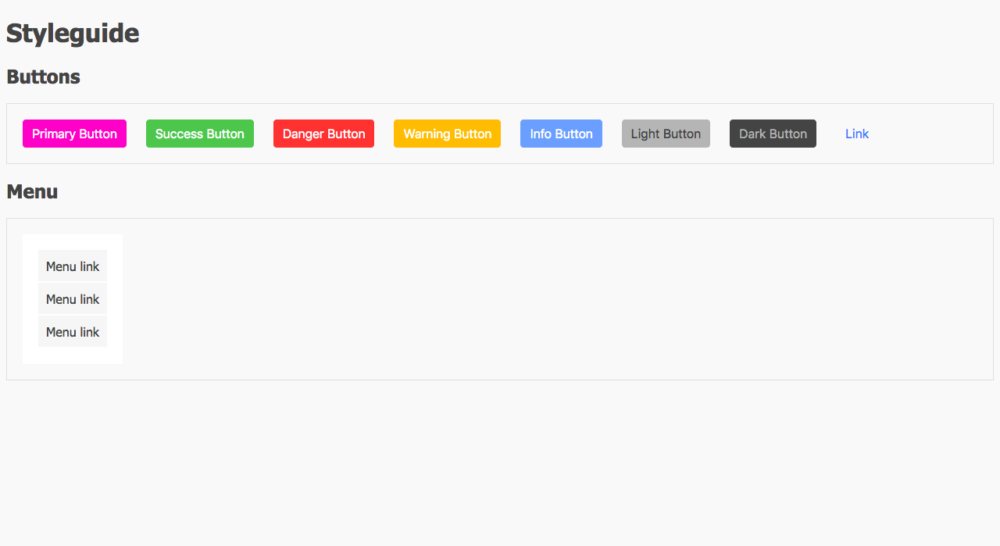

# A tiny styleguide

Let's create and overview of the styled elements available.
Currently our styleguide has only buttons an a menu.

Use the starter HTML file (or don't, up to you :)).

* [] Use npm to manage your packages
* [] Use sass
* [] Use nesting `&`
* [] Use variables for each color
* [] Use partials

Extra:

* Can you define 3 sizes for buttons: small, normal and large?